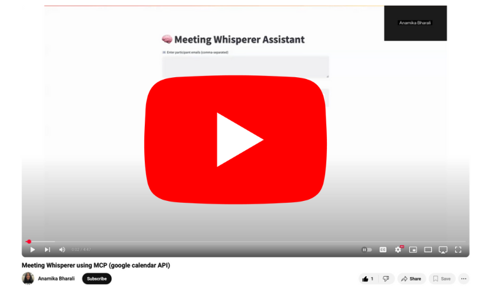

# 🧠 Meeting Whisperer

**Smart Meeting Assistant powered by LLMs, Google Calendar, and MCP**

---

## 📌 Overview
[](https://www.youtube.com/watch?v=loO_aYronZI&t=5s)

**Meeting Whisperer** is an intelligent assistant that automates the end-to-end workflow of:

- Summarizing meeting transcripts using GPT-4
- Extracting action items for each participant
- Finding mutual availability across Google Calendars
- Detecting US national holidays
- Scheduling the next meeting via Google Calendar

The project is built using [**MCP (Model Context Protocol)**](https://modelcontextprotocol.io/) for modular tool orchestration and is designed for real-world productivity and professional collaboration.

---

## 🧬 What is MCP?

**MCP (Model Context Protocol)** 

Introduced November 2024 by Anthropic as an open-source protocol, MCP allows for the integration between LLM applications and external data sources and tools.

In this project, calendar scheduling and holiday detection are offloaded to **dedicated MCP tool servers** — making the system highly modular and extensible.

---

## 🚀 Features

| Feature                           | Description |
|----------------------------------|-------------|
| 🧠 GPT-powered Summary           | Extracts concise summaries and action items using OpenAI GPT-4 |
| 📅 Mutual Availability Check     | Finds earliest shared availability using Google Calendar API |
| 🏖️ Holiday Conflict Detection    | Identifies US national holidays via separate MCP server |
| 📤 Google Calendar Integration   | Creates and sends calendar invites to all participants |
| 🔌 Modular Design with MCP       | Uses FastMCP to manage tool servers independently |

---

## 📁 Project Structure

MeetingWhisperer/
├── streamlit_ui.py            ← Main Streamlit frontend
├── summarize_utils.py         ← GPT summarization logic
├── calendar_server.py         ← MCP tool server for Google Calendar
├── holiday_server.py          ← MCP tool server for holiday checking
├── authorize_google.py        ← Script to generate calendar tokens
├── token.json                 ← Creator's calendar token
├── tokens/                    ← Folder containing participant tokens (e.g., tokens/email1.json)
├── .env                       ← Contains your OpenAI API key

---

## 🛠️ Setup Instructions

### 1. Clone and Install Dependencies

```bash
git clone https://github.com/yourusername/meeting-whisperer.git
cd meeting-whisperer
uv venv
uv pip install -r requirements.txt
```


### Add OpenAI API

Create a .env file in the root directory:
```bash
OPENAI_API_KEY=your_openai_key_here
```

### 3. Google Calendar Setup
Go to Google Cloud Console
Create a project → Enable Google Calendar API
Download your OAuth 2.0 credentials → save as client_secret.json
Then authorize your own calendar:
```bash
uv run python authorize_google.py
```
For participants, place their tokens as:
```bash
tokens/<participant_email>.json
```
### 4. Run MCP Tool Servers
In separate terminals:
```bash
uv run python calendar_server.py
```
```bash
uv run python holiday_server.py
```
### 5. Run the Streamlit App
```bash
uv run streamlit run ui.py
```
## 🎥 Demo Flow

📤 Upload a .txt meeting transcript

📧 Enter participant email addresses

🧠 Generate summary & action items using GPT-4

🗓️ View the next suggested meeting date (from transcript)

🔍 Check for calendar availability + holiday conflicts

✅ Create a Google Calendar invite at the mutual time

📨 Event appears on all participant calendars

## 🧠 Future Plans

🔁 Recurring meeting detection & suggestions

💬 Slack/email delivery of summaries

📞 Zoom & Microsoft Teams integration

🏢 Support for custom org-wide holidays

📅 ICS calendar download and multi-timezone support

👤 Optional user authentication for enterprise use

## 👩‍💻 Author

### Anamika Bharali
M.S. in Information Systems, Northeastern University
Data Scientist | AI Automation | NLP

🌐 LinkedIn: https://www.linkedin.com/in/anamikabharali/ 

